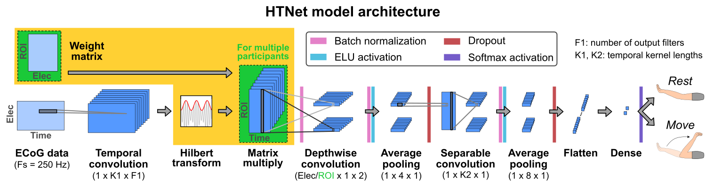

# HTNet: generalized decoding for ECoG and cross-modal neural datasets


## Overview

HTNet is a convolutional neural network decoder, heavily based on the [EEGNet model](https://github.com/vlawhern/arl-eegmodels) developed by Lawhern et al. The key modifications are that HTNet converts data to the frequency domain (via the filer-Hilbert method) and then projects data onto common brain regions (using [measure projection](https://github.com/bigdelys/measure_projection)). This projection step aligns data from participants with heterogeneous electrode locations, a common issue for multi-participant ECoG analyses.

The HTNet model code is available in *htnet_model.py*. This model is written in Python and relies on Keras and Tensorflow.





## Citing our paper

If you use our code, please cite our published *Journal of Neural Engineering* [paper](https://doi.org/10.1088/1741-2552/abda0b).

```
Peterson, S. M., Steine-Hanson, Z., Davis, N., Rao, R. P. N., & Brunton, B. W. (2021).
Generalized neural decoders for transfer learning across participants and recording modalities.
Journal of Neural Engineering. https://doi.org/10.1088/1741-2552/abda0b
```


## Replicating our published findings

To replicate the findings from our paper, create a new conda environment using the environment.yml file. Next, download the [ECoG](https://figshare.com/projects/Generalized_neural_decoders_for_transfer_learning_across_participants_and_recording_modalities/90287) and [EEG](http://bnci-horizon-2020.eu/database/data-sets) datasets (use dataset #25 for EEG). The EEG data can be preprocessed using *Load EEG dataset.ipynb*.


**1) Run all decoder training and testing analyses**

Open *train_decoders.py* and set rootpath to be the directory above your ecog_dataset and eeg_dataset directories and then run it. Note that this script will run every analysis from our paper at once, which takes several days to run. The different analyses are separated out in the script in case you want to comment out certain ones. This script also requires a GPU (change the value for os.environ["CUDA_VISIBLE_DEVICES"] if you need to switch to a different GPU).


**2) Plot results**

Once *train_decoders.py* has finished runnning, open *Plot_figures.ipynb* and add the rootpath directory you used previously. Each cell will produce a plot similar to the figures in the paper. Note that the HTNet interpretability cell requires a GPU to compute the frequency response of the temporal convolution.

Note that the default images were generated using models trained for only 2 epochs as a test, so they do not match our manuscript figures.


**3) Hyperparameter tuning [optional]**

Additionally, we have included our hyperparameter tuning code (*hyptuning_optuna.py*), which uses Optuna to tune hyperparameters.
